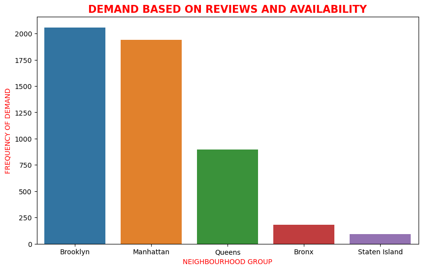

# Airbnb Market Analysis: Pricing Trends and Listing Insights

## Introduction
This project analyzes Airbnb listing data to explore pricing patterns, availability trends, and market dynamics across different neighborhoods. The goal is to uncover insights that help hosts, travelers, and stakeholders understand key factors influencing listing performance and pricing behavior.

Python was used for data cleaning and exploratory analysis, while data visualization techniques were applied to present insights clearly and effectively.

## Business Questions
The analysis focused on answering the following key business questions:
1. What factors influence Airbnb listing prices?
2. How do prices vary across neighborhoods and room types?
3. Which areas have the highest listing availability?
4. How do reviews and host activity impact listing performance?

## Tools and Technologies 
- Python – Data cleaning, transformation, and exploratory analysis
- Pandas – Data manipulation and preprocessing
- Matplotlib & Seaborn – Data visualization and trend analysis

## Data Description
The dataset contains Airbnb listing records across different neighborhoods, providing detailed information about listing characteristics, pricing, availability, and host activity. It helps analyze market trends, pricing behavior, and listing performance patterns.

Key variables include:
- Neighborhood – Location of the listing
- Room Type – Type of accommodation offered
- Price – Cost per night
- Availability – Number of days available per year
- Number of Reviews – Total customer reviews
- Host Activity – Level of host engagement

## Data Cleaning
A structured workflow was followed to prepare the dataset for accurate and reliable analysis:
- Handled missing and invalid values
- Removed duplicate records
- Standardized data formats and corrected inconsistencies
- Converted numerical fields into appropriate data types
- Verified data integrity before analysis
## Exploratory Analysis
The dataset was explored to identify patterns, trends, and relationships affecting Airbnb listing performance and pricing behavior.
Key areas of analysis included:
- Price distribution across neighborhoods and room types
- Availability patterns and listing demand
- Relationship between reviews and listing popularity
- Variation in pricing across different locations
- Host activity and its impact on listing performance
## Key Insights
1. Prices varied widely across neighborhoods, with high-demand areas having the highest averages.
2. Entire homes were generally more expensive than private or shared rooms.
3. Listings with more reviews tended to have higher demand and popularity.
4. Availability patterns indicated that many listings were not available year-round, suggesting varying occupancy rates.
5. Many listings were not available year-round, indicating varying occupancy levels.
## Visualization
### Demand by Neighbourhood Group

## Business Recommendations
Many listings were not available year-round, indicating varying occupancy levels.
- Hosts should set competitive prices based on neighborhood demand and location advantages.
- Increasing listing availability can improve booking opportunities and revenue potential.
- Encouraging customer reviews can enhance listing visibility and attract more guests.
- Hosts should maintain active engagement to improve listing performance and trust.
## Project Outcome
This project transformed Airbnb listing data into insights on pricing trends, demand patterns, and listing performance. The analysis highlighted key factors influencing market dynamics, including neighborhood location, room type, host activity, and customer reviews.

Using Python for data preparation and exploratory analysis, the project supports data-driven pricing strategies and informed decision-making for hosts and stakeholders.
## Dataset Access
The dataset used for this analysis is available in this repository for transparency and reproducibility.
## Author
Zuera Alabi
Data Analyst | Python | Excel | Power BI | SQL

Passionate about transforming raw data into actionable insights that support data-driven decision-making.

